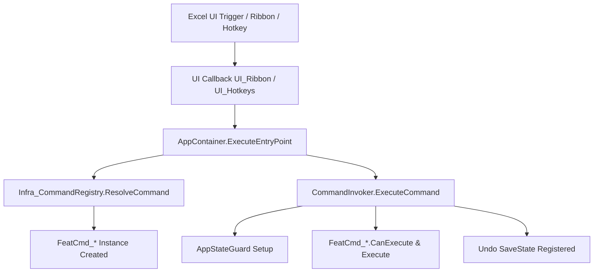

# Beaver Add-in - Gemini Guide

This file is the canonical project blueprint and operational guide for AI agents working in this repo. It contains stable project facts, runtime architecture, configuration schemas, coding standards, change patterns, and response guidelines. Read this file first to understand the codebase and change files safely.

> [!IMPORTANT]
> **EXCLUSIVELY AI-MAINTAINED CODEBASE**
> This repository is maintained, refactored, and built entirely by autonomous AI agents (such as Gemini). There are no human developers maintaining the codebase directly; human interaction is restricted to specifying requirements or reviewing execution plans.
> 
> Because subsequent agents will build directly on your changes, you must:
> 1. **Keep it self-documenting**: Make code self-documenting, clean, and strictly typed.
> 2. **Adhere to design patterns**: Do not break established patterns like the `ICommand` pipeline, `AppContainer` DI, `Infra_AppStateGuard` cleanup, and `Infra_Error.Track` error wrappers.
> 3. **Keep tests passing**: Ensure the build pipeline (`Update.ps1`) compiles and all tests pass perfectly before completing any task.
> 4. **Add unit tests**: Cover any new command, custom logic, or helper with automated unit tests in a dedicated module under `Modules\Tests` (e.g., `Lib_Tests_Feat_*.bas`) using the prefix `Public Sub Test_*`.

Current config version: 2.0.68

---

## 1. Project Overview & Purpose

Beaver is an Excel VBA add-in for fast workbook operations, lightweight automation, and repeatable spreadsheet workflows.

Core capabilities:
- Range formatting and paste-format helpers
- Formula manipulation and formula-to-value conversion
- Text cleanup and date normalization
- Workbook duplication and range export
- Link breaking
- A manifest-driven Ribbon and hotkey system
- Worksheet UDFs: `XFilter`, `XUnpivot`
- A lightweight VBA test harness
- A command-oriented execution pipeline built around `ICommand`

---

## 2. Source of Truth & File Ownership

### Authorized Source Files
Treat the exported text files in this repo as authoritative:
- `Modules\**\*.bas` and `Modules\**\*.cls` are the editable VBA source.
- `ThisWorkbook.cls` is the authoritative workbook event module on disk.
- `features.json` is the authoritative feature manifest for Ribbon controls, command names, icons, release tiers, runtime-test modes, and hotkeys.
- `config.json` is the authoritative configuration for add-in identity and UI constants. `Update.ps1` synchronizes its `Hotkeys`, `Icons`, and `FeatureFlags` sections, including `GeneratedFeatureCount`, from `features.json`.
- `ribbon.xml` is generated from `features.json` by `Update.ps1`.
- `Modules\Infrastructure\Infra_CommandRegistry.bas` is generated from `features.json` by `Update.ps1`.
- `Beaver Add-in.xlsm` is the compiled workbook artifact synchronized by `Update.ps1`.

Do not make manual changes in the VBE and leave disk exports stale. Edit the text files first, then run `.\Update.ps1`.

### Files and Sheets to Never Touch Manually
- `Beaver Add-in.xlsm` directly. Always use `Update.ps1` to sync changes.
- `Modules\Libraries\Lib_JsonConverter.bas`. It is a third-party library.
- `Update.ps1` unless the build/sync pipeline itself is the task.
- `.frx` files. They are binary and auto-generated by the VBE.
- Hidden workbook support sheets such as `_BeaverUndo` or `_BeaverTests`, if they exist.

### Project Layout
```text
Excel Add-in\
|- Beaver Add-in.xlsm
|- ThisWorkbook.cls
|- ribbon.xml
|- features.json
|- config.json
|- Update.ps1            (Unified pipeline orchestrator stub)
|- GEMINI.md             (Consolidated project guide)
|- .build\
|  |- Update.ps1         (Core orchestrator implementing build & test coordination)
|  |- Build.ps1          (Compilation & XML injection pipeline)
|  |- Test.ps1           (VBA unit tests & Ribbon scraper validation runner)
|  |- BuildSupport.ps1   (Shared build & COM execution utilities)
|  \- Linter.ps1         (Syntax, style guide, and MSForms Form validation)
\- Modules\
   |- Commands\
   |  \- FeatCmd_*.cls         ICommand feature implementations
   |- Core\
   |  |- AppContainer.cls      DI / service locator and command resolver
   |  \- ICommand.cls          command execution interfaces
   |- Infrastructure\
   |  \- Infra_*.bas/.cls      infrastructure, config, diagnostics, typed requests/contexts
   |- Libraries\
   |  \- Lib_*.bas             libraries, UDFs, and help manifest
   |- Tests\
   |  \- Lib_Tests*.bas        unit test suites, test runner, and test manifest
   \- UI\
      |- UI_Ribbon.bas         Ribbon callbacks
      |- UI_Hotkeys.bas        hotkey callbacks
      |- UI_OptionPicker.frm   reusable choice picker dialog (and .frx)
      \- UI_HelpCenter.frm     scrollable Help Center dialog (and .frx)
```

---

## 3. Development Workflow & Change Patterns

### First Steps when Starting Work
1. Read this guide (`GEMINI.md`).
2. Open the target VBA module and its listed `@Dependencies`.
3. Identify the entry path: Ribbon, hotkey, workbook event, or utility.
4. Check whether the change touches `features.json`, `config.json`, or `ribbon.xml`.
5. Decide whether the change is source-only or requires `.\Update.ps1`.

### Safe Edit Order
1. Inspect the source module and supporting infrastructure.
2. Make the smallest change that fits the current architecture.
3. Update `features.json` if the UI or command contract changes.
4. Update `config.json` only when a shared setting (e.g., under `UIConstants`) must change. Hotkeys and icons are synchronized automatically from `features.json` by `.\Update.ps1`.
5. Keep any new VBA entry point covered by the standard error pattern (see [Error Handling Pattern](#error-handling-pattern)).
6. Run `.\Update.ps1` to sync, compile, and validate.
7. Fix validation, import, compile, or runtime issues.

### Change Patterns

#### Adding a New Ribbon Command
- Add or update the feature entry in `features.json`. If a new tab is needed, transition the single `"Tab"` block to a `"Tabs"` array and reference `TabId` inside your Ribbon groups.
- Add the new command class (`FeatCmd_*`) implementing the `ICommand` interface.
- Run `.\Update.ps1`. This will automatically:
  - Generate the `Ribbon_On*` callback in `UI_Ribbon.bas`.
  - Regenerate `Infra_CommandRegistry.bas` to map the entry macro/command name to the new class.
  - Sync the icon mapping and feature flag count into `config.json`.
  - Re-generate `ribbon.xml` and inject it into the workbook.

#### Adding a New Hotkey
- Add or update the hotkey entry in `features.json`.
- Add/update the command implementation class (`FeatCmd_*`) or map to an existing command.
- Run `.\Update.ps1`. This will automatically:
  - Generate the hotkey wrapper in `UI_Hotkeys.bas`.
  - Regenerate `Infra_CommandRegistry.bas` to map the new wrapper to the command.
  - Sync the hotkey binding into `config.json`.

#### Adding a New Configuration Value
- Add the key to `config.json`.
- Update `Infra_ConfigModel`.
- Update `Infra_Config`.
- If the setting is stable and should be injectable, update `IConfig` too.
- Use the typed accessor everywhere else.
- If the value is a stable flag, add a typed property instead of leaving it as a raw `FeatureFlags` lookup.

### Build & Sync Workflow
The build and test pipeline is modularized into separate scripts and optimized for high-performance development (using MD5 hash-based change detection stored in `.\.build_state.json`):

- **Build Pipeline (`.build\Build.ps1`)**: Performs validation, generates registries/manifests, compiles, and imports VBA code into `Beaver Add-in.xlsm`.
- **Test Pipeline (`.build\Test.ps1`)**: Verifies Ribbon Custom UI load errors, runs internal VBA unit tests, and executes headless callbacks.
- **Syntax & Style Linter (`.build\Linter.ps1`)**: Performs syntax parsing, style guide compliance checks (such as verifying error handling structures and context tracking), and form companion (`.frx`) file integrity validation.
- **Unified Pipeline (`.\Update.ps1` stub / `.build\Update.ps1` orchestrator)**: Orchestrates the build, synchronization, linter execution, and test runs.

#### Pipeline Execution Modes

The pipeline operates in an automated, highly-optimized manner without requiring any manual execution mode switches:
- **Incremental Import & Reload (Default)**: If only VBA code changes, the scripts attach to the active Excel application process (if already running), remove only the modified modules (using actual component name parsing to prevent duplication), re-import them in-place, and run tests. If Excel was already open before running the pipeline, it remains open; if the script started a new Excel instance, it saves the workbook and quits Excel upon completion to prevent background file locks.
- **Fast-Iteration COM Session Keep-Alive (`-KeepAlive`)**: When running with the `-KeepAlive` switch, the script leaves the Excel COM session and workbook open on screen upon completion. Subsequent runs will instantly attach to this running session, reimport modified components, and execute tests in **under 1.5 seconds** (skipping Excel and workbook startup overhead).
- **Self-Healing Lock Recovery**: If background or orphaned Excel processes lock the workbook file as `Read-Only` during a run, the pipeline automatically detects the state, closes the read-only file, terminates non-responsive/hidden background Excel instances, cleans up orphaned lock files (`~$*.xlsm`), restores the COM session context, and reopens the workbook in write mode to proceed.
- **Auto-Detect Manifest Changes**: If `features.json` is modified, the script automatically closes the workbook to unlock the file, performs manifest/registry regeneration and Ribbon XML zip injection, reopens the workbook, and executes the Ribbon XML validation check.
- **Smart Test Filtering (Auto-Filter)**: When running a standard incremental build of command modules, the pipeline automatically detects which command files were changed and configures a default targeted filter to execute *only* the tests relevant to those features. This accelerates test cycles from ~4 seconds to ~1 second. It automatically falls back to running the full test suite if any core, library, or infrastructure files are modified.
- **Targeted Testing (`-Filter` Parameter)**: Allows executing specific tests or a subset of tests using wildcard pattern matching (e.g. `*CleanData*` or `*Undo*`) dynamically inside the VBA runner.
- **Additional Pipeline Controls**:
  - `-Force`: Bypasses incremental change detection and forces a full rebuild, Zip Ribbon XML injection, and module re-import.
  - `-ListTests`: Discovers and prints all unit test names matching the optional `-Filter` parameter.
  - `-SkipLint`: Skips running `.build\Linter.ps1` checks to reduce build times during local edits.
  - `-Visible`: Configures the Excel COM automation window to be visible during testing (defaults to hidden).
  - `-Clean`: Deletes the cached `.build_state.json` file and resets build/test logs.

Use the following commands from PowerShell:
```powershell
# Unified Run: Runs incremental or full build, lint check, and ALL tests in the active Excel session
.\Update.ps1

# Fast-Iteration: Keeps Excel session open so subsequent runs are extremely fast (<1.5s)
.\Update.ps1 -KeepAlive

# Targeted Iteration with Caching: Run incremental build and only tests matching "CleanData" while keeping Excel open
.\Update.ps1 -Filter "CleanData" -KeepAlive

# Build Only: Performs the build, synchronization, and compile stages but skips tests
.\Update.ps1 -SkipRuntimeTests

# Run specific tests on the active Excel session directly without rebuilding
.\.build\Test.ps1 -Filter "*CleanData*"
```

#### Guidelines for AI Agents:
1. **Iterate with Keep-Alive & Filtered Tests**: When developing or refactoring, always use `.\Update.ps1 -Filter <FeatureName> -KeepAlive` to compile, reload, and verify changes in under 1.5 seconds without closing Excel.
2. **Final Verification**: Before completing any task, you **MUST** run the full `.\Update.ps1` (with no filters or flags) to verify clean compilation, Ribbon UI validation, and that all 300+ unit tests pass successfully.

#### Prerequisites:
- Excel must allow "Trust access to the VBA project object model".
- The environment must support Excel COM automation.

### Validation Order
When validating changes, verify in this order:
1. **Manifest/config consistency**: Ensure JSON files are valid and match each other.
2. **Standard Validation**: Run `.\Update.ps1 -Filter <FeatureName> -KeepAlive` to quickly verify compile and unit test success.
3. **Full Production Validation**: Run `.\Update.ps1` to ensure the final clean compilation and full test suite execution pass cleanly.

---

## 4. Runtime Architecture

The architecture is command-oriented rather than direct macro-to-feature wiring.



### Entry Paths
1. **Workbook Lifecycle**:
   - `ThisWorkbook.Workbook_Open` calls `Infra_Bootstrap.Startup`.
   - `ThisWorkbook.Workbook_BeforeClose` calls `Infra_Bootstrap.Shutdown`.
2. **Ribbon Callbacks**:
   - `UI_Ribbon.bas` exposes thin `Ribbon_On*` procedures referenced by `features.json` and `ribbon.xml`.
   - These callbacks call `AppContainer.ExecuteEntryPoint` to delegate business logic.
3. **Hotkeys**:
   - `Infra_Hotkeys` registers `Application.OnKey` bindings from `config.json`.
   - Those bindings point to `UI_Hotkeys.bas`, which forwards to `AppContainer.ExecuteEntryPoint`.

### Bootstrap & Container
- `Infra_Bootstrap.Startup` initializes `AppContainer` with `Infra_Config`, `Infra_Error`, and `ExcelContextProvider`, registers hotkeys, and registers worksheet UDFs (via `Lib_UdfRegistry`) in the Function Wizard.
- `Infra_Bootstrap.Shutdown` unregisters hotkeys.
- `Infra_Bootstrap.EnsureStarted` ensures container initialization for late-entry scenarios.
- `AppContainer` is the central dependency container and command resolver.
- `AppContainer.ResolveCommand` delegates to `Infra_CommandRegistry` to map manifest command names (e.g. `Wrap`) to their respective `FeatCmd_*` classes.
- `AppContainer.CreateCommandContext` builds a `BasicCommandContext` with entry macro, trigger source, kind, and Excel action context.

### Command Pipeline
- `features.json` and hotkey metadata define `CommandName` values.
- `Infra_CommandRegistry` maps entry macros to command names and instantiates command objects.
- `AppContainer.ExecuteEntryPoint` resolves the command and calls `CommandInvoker.ExecuteCommand`.
- `CommandInvoker.ExecuteCommand` runs `CanExecute`, applies `Infra_AppStateGuard`, executes the command, and registers any Undo actions.
- Shared helpers in `Infra_CommandSupport` convert `ICommandContext` into `Infra_ActionContext` and resolve worksheets for bulk operations using the centralized `ResolveWorksheetsToProcess` helper.

### Shared Infrastructure
- `Infra_AppStateGuard`: Captures and restores Excel application state (e.g., `ScreenUpdating`, `EnableEvents`, `DisplayAlerts`, `Calculation`). Always declare inline as `Dim guard As New Infra_AppStateGuard` to leverage RAII cleanup on scope exit.
- `Infra_AppState`: Captures workbook, worksheet, cell, and range context, providing selection helpers.
- `Infra_Config`: Loads `config.json` through the typed `Infra_ConfigModel` (exposing UI constants and safety threshold constants).
- `Infra_Error`: Centralizes tracking, breadcrumbs, diagnostics, user-facing error handling, and failsafe reset behavior.
- `Infra_ContextTracker`: Provides RAII-style `PushContext` and `PopContext` support via `Infra_Error.Track`. Assign this to an object variable so cleanup occurs correctly on exit.
- `Infra_Interaction`: Centralizes message boxes, text prompts, range prompts, and reusable `UserForm`-based option pickers.
- `Infra_UIFactory`: Implements standardized picker dialogs using `UI_OptionPicker` and creates typed request objects (such as the unified `Infra_ScopedRequest` and the specialized `Infra_CleanDataRequest`).
- `Infra_ValueConversion`: Provides shared data and formula conversion utilities.
- `Infra_Undo`: Provides custom undo support for range mutations, securely buffered inside `ThisWorkbook`'s private sheet to protect user data from being saved or leaked inside external target workbooks.
- `Infra_Progress`: Provides status-bar progress reporting for slow-running tasks.
- `Infra_Diagnostics` & `Infra_ErrorContext`: Support environment capture and troubleshooting (contains a trace logging toggle to avoid log file bloating).
- `AppContainer`: Provides shared process-level state and dependency access (holding references to Config, ErrorTracker, and ContextProvider).

---

## 5. Ribbon, Hotkey, & Config Contracts

### Feature Surface

> [!NOTE]
> **Dummy / Testing Tools**
> `HelloWorld` (and its associated controls/classes) is a dummy mock tool used solely for validating the build pipeline's change detection, file picking, and incremental module reload behavior. Minor changes, additions, or deletions of this tool are done strictly for testing script robustness and should not be confused with core project features.

#### Ribbon-Backed Commands
- `Wrap` -> `FeatCmd_Wrap` (Supports formula reuse and pattern typing)
- `StaticSheetWorkbook` -> `FeatCmd_StaticSheetWorkbook`
- `CleanData` -> `FeatCmd_CleanData`
- `ModifyData` -> `FeatCmd_ModifyData` (Acts as the command class for menus like `DateFixer` and `CaseFixer`)
- `HighlightData` -> `FeatCmd_HighlightData` (Acts as the command class for `HighlightInconsistentFormulas`, `HighlightDuplicates`, `HighlightErrors`, `HighlightHardcodedValues`, `HighlightDataValidations`, and `HighlightConditionalFormatting`)
- `BreakExternalLinks` -> `FeatCmd_BreakExternalLinks`
- `Duplicate` -> `FeatCmd_Duplicate`
- `ExportImageOrPdf` -> `FeatCmd_ExportImageOrPdf` (Acts as the command class for `ExportPng` and `ExportPdf`)
- `ShowHelpCenter` -> `FeatCmd_ShowHelpCenter` (Displays guidance, hotkeys, and diagnostics in a scrollable UserForm)
- `HelloWorld` -> `FeatCmd_HelloWorld`
- `TableOfContents` -> `FeatCmd_TableOfContents` (Creates a hyperlinked index sheet at the beginning of the workbook)
- `UnmergeFill` -> `FeatCmd_UnmergeFill` (Unmerges the selected cells and fills the parent value to all unmerged cells)
- `ForceNumber` -> `FeatCmd_ForceNumber` (Forces text-formatted numbers in the selection to become actual numeric values)

#### Hotkey-Driven Commands
- `ApplyCustomNumberFormat` -> `FeatCmd_ApplyCustomNumberFormat`
- `MakePermanent` -> `FeatCmd_MakePermanent`
- `CreateSheet` -> `FeatCmd_CreateSheet`
- `FillDown` -> `FeatCmd_FillDown`
- `FilterByCell` -> `FeatCmd_FilterByCell`
- `PasteFormat` -> `FeatCmd_PasteFormat`
- `FormatRange` -> `FeatCmd_FormatRange`
- `Backspace` -> `FeatCmd_Backspace`
- `Delete` -> `FeatCmd_Delete`

#### User Defined Functions (UDFs)
- `Lib_XFilterFunction.XFilter` (Filters lists based on intersection/difference, supports case-sensitivity, custom empty-value returns, and is dynamically registered in the Function Wizard)
- `Lib_XUnpivotFunction.XUnpivot` (Unpivots a range of data by transforming column/value arrays into structured rows, and is dynamically registered in the Function Wizard)
- `Lib_UdfRegistry` (Provides a centralized registry of User Defined Function metadata for bootstrap registration and Help Center display)

#### Testing Entry Point
- `Lib_Tests.RunAllTests` (Uses the generated test manifest in `Lib_TestManifest.bas` which collects all `Public Sub Test_*` procedures).

### Ribbon & Hotkey Contract

#### Ribbon Groups
- **Formatting**: Wrap (mode picked in a `UserForm`), static sheet/workbook.
- **Data Tools**: Clean data, modify data, highlight data, break links.
- **File Actions**: Duplicate workbook, export range.
- **Reports**: Table of Contents.
- **Support**: Help center.
- **Hello World Group** *(Office Tools tab)*: Hello World.

*UI Interaction Design Rules:*
- **Fixed-choice and multi-select checkbox flows** (e.g. Clean Data options, Export format, Make Static scope, Break Links scope, Wrap mode, and sheet placement) must use the reusable `UI_OptionPicker` UserForm:
  - **Dynamic Sizing**: The layout and window size of the picker are calculated dynamically (via `ResizeOptionPickerLayout`) based on the length of the longest option text and option count. Standard form elements like title prompts are hidden to prevent extra empty space. In multi-select mode, OK and Cancel buttons are programmatically displayed and positioned at the bottom of the list box.
  - **Single-Select Behavior**: In single-select mode, clicking or double-clicking any list option immediately confirms the selection and hides the picker. It uses a row height based on font size + 5, and is capped at a maximum height of 8 visible options.
  - **Multi-Select Behavior**: In multi-select mode, options display in a custom checklist format (using Unicode ballot box checkbox prefixes `☐` and `☑`) inside a single-select list box, ensuring standard blue selection highlights for visible keyboard arrow navigation. The list box font is programmatically configured to **Segoe UI** to support Unicode checkbox characters natively without fallback height mismatches. Clicking (on `MouseUp`) or pressing `Spacebar` toggles the checked prefix state, while keyboard arrow keys safely navigate and select items without toggling them. It uses a row height of font size + 8, and is capped at a maximum height of 12 visible options. Confirming is done via pressing Enter or clicking OK, and cancelling is done via pressing Escape, clicking Cancel, or closing the window.
  - **Keyboard Navigation**: Active focus is programmatically set to the list box control (`lstHotkeys.SetFocus`) on form activation. It supports visual non-selectable section headers prefixed with a diamond bullet (`◆`), which are automatically skipped during arrow-key navigation. Pressing Enter (`vbKeyReturn`) confirms the selection, and Escape (`vbKeyEscape`) cancels.
  - **Preference Namespacing**: Use the optional `prefNamespace` parameter in `UI_OptionPicker` configuration and corresponding helper APIs (`PromptOption`, `PromptMultiOption`) to save and load user preference keys under distinct namespace prefixes in the registry. This keeps choice preferences completely isolated across different features.
- **Free-form inputs** (e.g. formula patterns) must use text prompts.
- **Save destinations** (e.g. duplicate/export flows) must use a shared Save As picker with Desktop-based defaults and overwrite confirmation.
- **Ribbon Icon Selection**: When choosing or modifying icons (`imageMso`) in `features.json`, you must only use identifiers that are natively verified and loaded in Microsoft Excel (e.g., `TableProperties`, `TableOfContentsDialog`, `ErrorChecking`, `FunctionWizard`, `CalculateNow`, `Clear`, `ChangeCase`, `ConditionalFormattingMenu`, `WorkbookLinks`, `FileSaveAs`, `Export`, `Help`, `HappyFace`). Do not use Access-only, Word-only, or custom application-specific icons (like `ReportInsert`, `InsertTableOfContents`, `StatusSpreadsheet`, or `DocumentInspector`) as they will throw runtime Custom UI XML errors when Excel loads the add-in.

#### Ribbon controls in `features.json`
- `BtnWrap`, `BtnStaticSheetWorkbook`, `BtnCleanData`, `BtnModifyData`, `BtnHighlightData`, `BtnBreakLinks`, `BtnDuplicate`, `BtnExport`, `BtnHelpCenter`, `BtnHelloWorld`, `BtnReportGenerator`, `BtnTableOfContents`, `BtnUnmergeFill`, `BtnForceNumber`.

#### Hotkeys in `config.json`
- `^+4` -> `UI_Hotkeys.Hotkey_ApplyCustomNumberFormat`
- `^+p` -> `UI_Hotkeys.Hotkey_MakePermanent`
- `+{F11}` -> `UI_Hotkeys.Hotkey_CreateNamedSheet`
- `^%{DOWN}` -> `UI_Hotkeys.Hotkey_FillDown`
- `^+f` -> `UI_Hotkeys.Hotkey_FilterBySelectedCell`
- `^+m` -> `UI_Hotkeys.Hotkey_PasteFormat`
- `^+q` -> `UI_Hotkeys.Hotkey_FormatSelectedRange`
- `{BACKSPACE}` -> `UI_Hotkeys.Hotkey_Backspace`
- `{DELETE}` -> `UI_Hotkeys.Hotkey_Delete`

*Rule:* If you add or modify a shortcut, update `features.json` and run `Update.ps1` to sync it. Do not hardcode `Application.OnKey` bindings in feature modules.

### Config Contract
`config.json` schema contains `UIConstants`, `SafetyConstants`, `AddinIdentity`, `FeatureFlags`, `Hotkeys`, and `Icons`.

#### Schema Snapshot
```json
{
  "UIConstants": {
    "DefaultFontName": "Calibri",
    "DefaultFontSize": 10,
    "HeaderFontSize": 11,
    "DefaultNumberFormat": "#,##0",
    "DisplayDateFormat": "dd/mm/yyyy",
    "ColumnWidthThreshold": 40,
    "MaxColumnWidth": 25,
    "HeaderColor": "#AEAAAA",
    "DefaultExportScale": 3,
    "MaxExportScale": 10
  },
  "SafetyConstants": {
    "MaxUndoCells": 1000000,
    "MaxWrapCells": 50000,
    "MaxFormulaCheckCells": 5000,
    "MaxFillProximityColumns": 10,
    "MaxFillDownAreas": 5000
  },
  "AddinIdentity": {
    "Name": "Beaver Add-in",
    "Version": "2.0.68"
  },
  "FeatureFlags": {
    "ManifestFile": "features.json",
    "GeneratedFeatureCount": 23
  },
  "Hotkeys": [
    {
      "Key": "^+4",
      "Macro": "UI_Hotkeys.Hotkey_ApplyCustomNumberFormat",
      "CommandName": "ApplyCustomNumberFormat",
      "Description": "Apply custom number format"
    }
  ],
  "Icons": {
    "BtnWrap": "FunctionWizard",
    "BtnStaticSheetWorkbook": "CalculateNow",
    "BtnCleanData": "Clear",
    "BtnModifyData": "ChangeCase",
    "BtnDateFixer": "CalculateNow",
    "BtnCaseFixer": "ChangeCase",
    "BtnHighlightData": "ConditionalFormattingMenu",
    "BtnHighlightInconsistentFormulas": "CalculateNow",
    "BtnHighlightDuplicates": "ConditionalFormattingMenu",
    "BtnHighlightErrors": "ErrorChecking",
    "BtnHighlightHardcodedValues": "FunctionWizard",
    "BtnBreakLinks": "WorkbookLinks",
    "BtnDuplicate": "FileSaveAs",
    "BtnExport": "Export",
    "BtnExportPng": "FileSaveAs",
    "BtnExportPdf": "Export",
    "BtnHelpCenter": "Help",
    "BtnHelloWorld": "HappyFace",
    "BtnReportGenerator": "TableProperties",
    "BtnTableOfContents": "TableOfContentsDialog",
    "BtnUnmergeFill": "TableProperties",
    "BtnForceNumber": "CalculateNow"
  }
}
```

*Notes:*
- `GeneratedFeatureCount` is updated automatically by `Update.ps1` from the enabled manifest features.
- To add a setting: (1) Add it to `config.json`, (2) Update `Infra_ConfigModel`, (3) Expose it via `Infra_Config`, (4) Access via the typed accessor.

---

## 6. Code Standards & Patterns

### VBA Coding Rules
- `Option Explicit` is mandatory at the top of every `.bas` and `.cls` file.
- Metadata headers are required for every VBA source file:
  ```vba
  ' @Module: ModuleName
  ' @Category: Infrastructure/Feature/UI/Library
  ' @Description: Short description
  ' @ManagedBy: BeaverAddin Agent
  ' @Dependencies: Dependency list
  ```
- Keep UI callbacks and workbook events thin.
- Prefer command classes (`FeatCmd_*`) implementing the `ICommand` interface (`CanExecute` and `Execute`) for feature implementations.
- Use `Infra_CommandSupport.ActionContextFromCommandContext` instead of reading globals.
- Use array-based range processing over cell-by-cell loops for bulk performance.
- Use the unified `AreaHasSpill` helper in `Infra_ValueConversion` to verify the presence of dynamic array spills within ranges, avoiding redundant and slow cell-by-cell loops.
- Use `Infra_ValueConversion.ConvertRangeToValues` when converting formulas to static values. It optimizes spill-aware flattening by attempting bulk value assignment first, falling back area-by-area, and only resorting to cell-by-cell conversion (`ConvertCellToStatic`) for areas containing dynamic array spills.
- Qualify range checks as `TypeOf [Variable] Is Excel.Range` rather than `Range` for namespace safety and compiler specificity.
- Use `.Formula2` for modern, spill-safe formulas. Never use `.Formula`.
- Preserve user-facing constants in `config.json`.
- Iterate backwards using an index countdown (`For i = Collection.Count To 1 Step -1`) when mutating or deleting elements inside collections (such as `PivotTables`, `ListObjects`, or `Names`) to avoid dynamic re-indexing skip bugs.
- Safely intercept and translate literal Excel cell error variants (type `Error`) using `Select Case` with `CVErr()` constants (e.g., `Case CVErr(xlErrNA)`) before executing standard string or conversion operations (like `CStr()` or `CInt()`), preventing `Type mismatch (Error 13)` crashes.
- When querying range properties (such as `Range.NumberFormat`, `Font.Name`, or `Font.Size`) on a multi-cell range, always check if the return value is `Null` using `IsNull()` before attempting standard string conversions (like `CStr()`). A range with mixed values returns `Null`, which immediately throws `Invalid use of Null (Error 94)` on direct conversions.
- Apply formatting changes precisely to modified cells (e.g., using `AccumulateUnion` range accumulation) rather than using area-wide bulk formatting thresholds that might overwrite unrelated cell formats (such as currency formatting in mixed-data selections).
- Limit expensive cell-by-cell COM operations on large ranges (e.g., formula checks) to a safety cell count limit (e.g., 5,000 cells) to avoid freezing Excel. Always load safety thresholds dynamically from `Infra_Config` instead of hardcoding limits.
- Use `Infra_ValueConversion.Ensure2DArray` to convert variant inputs (Range, Array, or Scalar) into 1-based 2D arrays rather than implementing duplicate array-handling helpers.
- Use `Infra_Undo.SaveStateOrConfirm` before mutating worksheet ranges to check and register undo buffers. This unified helper automatically verifies if the range size is within safety limits and prompts/warns the user if it is not.
- Use `Infra_CommandSupport.GetSafeProcessingRange` to limit active selection/target processing ranges to the worksheet's active `UsedRange` based on config-defined safety thresholds, preventing performance degradation on whole column/row selections.
- Use `Infra_CommandSupport.GetSheetBreakableCounts` to count external formulas, links, pivot tables, and query tables on a sheet, preventing duplicate cell scanning logic across features.
- Enforce worksheet protection validations using `Infra_CommandSupport.ValidateWorksheetNotProtected` during command validation (`ICommand_Validate`) to prevent runtime failures on locked sheets.
- Use `ExcelContextProvider.CanModifyContext` to safely check if the active selection range is modifiable on protected sheets, properly accounting for mixed cell locking configurations.
- Flexible linter checks inside `.build\Linter.ps1` (integrated with `Build.ps1`) scan the entire procedure body to verify `Infra_Error.Track` is used, supporting descriptive comments at the top of public procedures.
- Do not manually edit generated files (`UI_Ribbon.bas`, `UI_Hotkeys.bas`, `Infra_CommandRegistry.bas`, `Lib_TestManifest.bas`).
- Always check `Application.Visible` or use standardized `Infra_Interaction` wrappers when displaying warning or information message boxes, to prevent automated/headless test suites or background processes from hanging on modal dialog prompts.

### Error Handling Pattern
All public entry points, UI callbacks, and workbook events must use the centralized error pattern:
```vba
Public Sub MyMacro()
    Dim tracker As Object: Set tracker = Infra_Error.Track("MyMacro")
    Dim guard As New Infra_AppStateGuard
    On Error GoTo ErrHandler

    ' work implementation

CleanExit:
    Exit Sub

ErrHandler:
    Infra_Error.HandleError "MyMacro", Err
    Resume CleanExit
End Sub
```
- **Error Boilerplate**: Always include `On Error GoTo ErrHandler`, `Infra_Error.Track`, and route errors via `Infra_Error.HandleError`.
- **Performance Bypass for High-Frequency Helpers**: For simple, low-level math or string helper functions executed inside tight cell-by-cell loops, do NOT allocate an `Infra_Error.Track` object. Instead, add a comment in the procedure body like `' [Bypass Lint] PushContext "ProcName" / PopContext / Infra_Error.Track` to pass the pipeline linter, while retaining the standard `On Error GoTo` and `HandleError` handlers.
- **Excel State**: Use `Infra_AppStateGuard` whenever Excel state changes.
- **Undo Registration**: Use `Infra_Undo.SaveStateOrConfirm` before mutating worksheet ranges when custom undo is needed (registration is delayed via the `CommandInvoker` pipeline).
- **Progress**: Use `Infra_Progress` for noticeably slow tasks.
- **Exits**: Prefer a single `CleanExit:` label.

---

## 7. Autonomous Agent Guidelines

> [!NOTE]
> This codebase has no human maintainers. All refactoring, feature development, bug fixing, and compilation checks are executed by AI agents. Code quality, reliability, and documentation hygiene must remain exceptionally high to ensure continuous automated updates.

### Operational Working Rules
- Always edit exported source files (`.bas`, `.cls`, `.frm`), not the compiled workbook.
- Keep `features.json`, `config.json`, `ribbon.xml`, `UI_Ribbon.bas`, and `UI_Hotkeys.bas` aligned.
- Avoid touching `Lib_JsonConverter.bas`, `.frx` files, or test/undo sheets.
- Follow the **Safe Edit Order** and **Validation Order** after every change.
- When creating or modifying `UserForm` `.frm` files, verify that a corresponding binary `.frx` file is also present and valid.
- Always run the full `Update.ps1` script (including runtime smoke tests) to confirm compilation succeeds and existing tests pass.
- Write new automated unit tests in the appropriate feature test module under `Modules\Tests` (such as `Lib_Tests_Feat_*.bas`) for any new feature or command to prevent regression by future agents.

### Response & Output Expectations
- Keep explanations short, practical, and concrete.
- Always list the exact files modified.
- Detail the validation runs you performed (e.g. compile success, tests run).
- Clearly state if any part of the change could not be verified.
- If a change affects architecture, update this guide immediately.

### Progress Updates
For larger or multi-step tasks, provide brief updates outlining:
- What has been inspected.
- What is being changed next.
- Any unexpected findings or obstacles encountered.

### Final Verification Checklist
Before completing a task, confirm:
1. Exported VBA files match this documented architecture.
2. Generated files were not manually edited.
3. Ribbon and hotkey contracts remain aligned.
4. The workbook sync path (`Update.ps1`) succeeds and compiles without error.
5. Prompt and interaction behaviors conform to the UI guidelines (OptionPickers vs SaveAs flows vs text prompts).
6. No "Last updated" date comments are left behind in markdown documentation.
